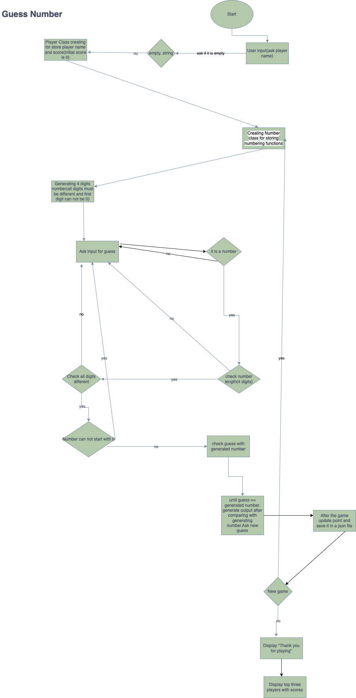
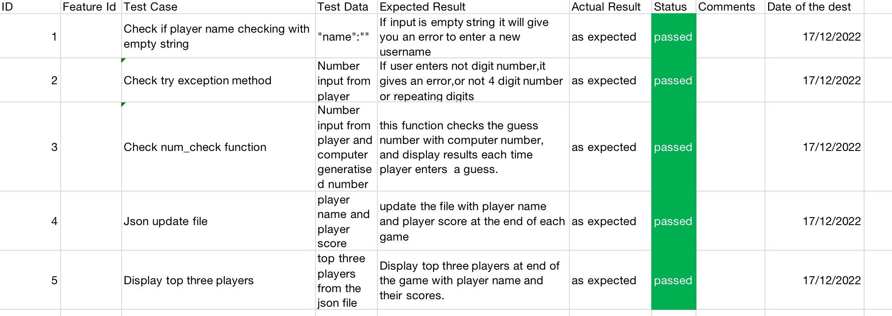

# Guess Number

I am trying to desing a guess number game.In the beginning computer choose a number between 1234 and 9876 because all numbers must be different. And you try to guess the number. For example computer chose 1234 and you guessed 1456 ,output would be +1 ,-1 because you did guess correct two number but one of them is in the correct position and the other is not.

At the end of the game , computer asks you for another game and saved your score.

- It is a game.

* Computer generated a number.
* You try to guess the computer generated number.
* Computer generate number from 1000 to 9999 but all numbers must be different.
* Number can not be 1000, 1222 ,1244,9999 etc..It means no repeating digits.
* Number can not start with 0.

I will go through the game step by step.

The game first ask your name and store it player variable.


Demonstration purposes, the generated number will be shown.

The game asks you for your guess.


There are some checks after a player enters their first guess.The game checks if user input is a digit, length is 4, has a repeating digits.


If user enter a number that length is not 4,it will give you an error.


If the guess starts with 0, again it will give you length error.


If there is a repeating number ,it gives an error.


If gues number is passed all parts above, guess comparing parts begins.


If you guess the number correctly, the game asks you for another game and store your point.


If your answer is y, new game starts.


When you write n, game ends and display thanks for playing and game time. And also top three players... List item shows there for demostration purposes.


# Desing Process

- First step: I developed class Player to store player names and scores. Initial score is 0


- Second step: I created Number class to store all numbering functions.
  In Number class ,I created first computer generates random number
  

* In Number Class I created main function for the game: Number checking.This is the last state for the function:


In this function,firstly check if guess equals the number,if so,print you win and then check if it is the first guess or not.If it is your first guess ,print your score,if not increase guess number 1 and print your score.
if your gues is not correct, firstly it checks if your guess is digit,length your guess and repating number.
If all passed,it starts comparing your guess with the number and display your guess opuput + and - expressions.
If not passed ,it asks you another guess and repearing the process again.

- During the previous step developing, I started to develop different digits function to check all digits are not same.The function is below:


- After creating functions above, I decided to check for username. If empty string is entered .it asking you for another name.The function is below:


- Game function creating.
  Beginning of the game function ,I check if the name entered is the correct format.


- After name checking, I creating try-except block to handle errors.Code as follows:


- After this point, I creating count variable and it equeals to a function in Number class num_check.It is the main function to compare guess with the number.


- After count variable returns, player point is updated. And Display point with the player name.Code as follows:


- After this step,Json file and csv file is updated.The code is follow.It calls the functions.I develop this functions as well .I added screedshots for the functions below.


- It is a json file update function.


- Csv update function is below:


- After this steps,new_game variable creating with input New game:Y/N
  If yes, game start again
  If no,printThanks for playing


- Timer function is working to calculate how long took for the game.


- At the end of the game, top three players are shown:


# Problems that I faced during the game development:

- Generate random four digits number. It is easy to generate 4 digits number but what I try to do each digits must be different and number not start with 0. To do that ,I used a function called number_guess in the Number class.First i cretaed a list called numbers with a member of only 0. First digit can not be 0 so I used while loop to check first digit.random.sample() function generate random number. random.sample(sequence,k).Sequence can be list,tuple,string or set. In this example random.sample(range(10),4) is a sequence numbers. K is an integer number, and it shows length of sampe.In this case k = 4.

* Create a num_check function. Basically it checks the user input with computer number and display output. I used two main argumant.First one if guess == computer number. In this case I need to check two importan things. First one is guess count number,it increases every wrong guess. It is the first guess or not. I used if statement for that


If it is not the first guess, I used else statment to check the guess number with computer number. I need to put checking paramenter beginning of the codes if number entered is digit number, check length of the number and not have repeating number.


After this check, program will check the user guess and computer number.


if it is not a valid number,it will give an error


- Json file update:
  It was kind of difficult to update json file. I could not find a way to initialize the json file from stractch. So I used in the seperate json file with inital value. I enter my name Serter as first name argument and my score, I entered 999 bigger number.My code as follows:


Json file example:


- Try.except code: First check was easy .It was a check if number is digit or not. I wanted to check if number guess length is 4 or not and also check if the number has repeating digits.

I used for those ones, else statements as follows:


- The last issue is to display top three players. I need to sort the json file with the lowest points.
  The json file is read first, and using lambda key word it is sorted with the lowest points.

Printing the lowest three points.


# Logic diagram

I add the logic diagram of the program.



# Bash script

Bash script is as follows:

```script
#!/bin/bash

set -u

if [[ -z "$VIRTUAL_ENV" ]]; then
    echo "No VIRTUAL_ENV set"
    pip install virtualenv
else
    echo "VIRTUAL_ENV is set"
fi

if [[ "$(python3 -V)" =~ "Python 3" ]]
then
  echo "Python 3 installed"
else
 python3 -m ensurepip --default-pip

fi
pip install -r requirements.txt

if [$(which python) = ""]
then
    echo "You do not have python"
    python -m ensurepip --default-pip
fi
pip install -r requirements.text

python3 ./src/game.py
```

# Testing

I did manual testing. I tested all required function such as num_check function, try/exception,json file update,display top three players,check the guess number.

I added the screen shots of the testing file.


